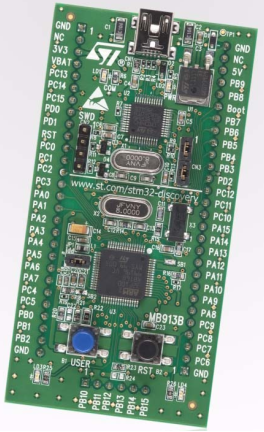
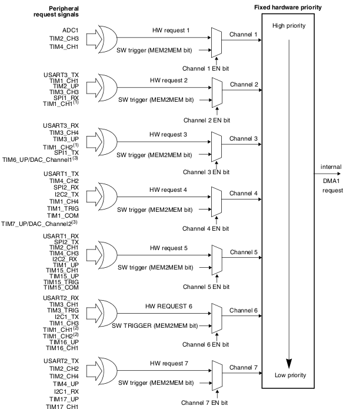

# Very short DMA introduction

What is DMA?

Direct Memory Access

Ok, but what does it do?

It copies data between memory and peripherals without CPU intervention. This is done using the DMA controller, which is a distinct hardware module. Nowadays it is incorporated in the MCU but in the past it used to be a separate chip.

What can I you use it for?

Assuming you want to send some bytes from a memory array to UART, you have two approaches: polling or using interrupts.

With polling you will use the CPU to load a byte from the memory array to the UART transmit register, check if the transfer is completed, increment through the array and repeat until end of array. This means using precious CPU cycles and the spending gets worse with the increase in array size.

The other way is to use an UART transmission interrupt. This comes with the advantage that you don't have to regularily check if the transfer is completed, but you will still need to increment through the array and load the transmission register. Also, the context switching to interrupt handler and back to what the CPU was doing takes some CPU cycles. If the transmission speed is high, then your CPU will spend more time serving interrupts than doing anything else.

And here comes DMA. You tell the DMA controller: transfer X bytes from this array over UART. And it will take care of everything: load the transmit register, increment through the array, and repeat untill all X bytes are sent. All this with no CPU intervention.

The DMA controller works both ways. You can also read from the peripheral, for example the UART receiver and write to a memory array a number of bytes.

# DMA controller on STM32

For this demo I used the `STM32VLDISCOVERY` board which is equipped with a `STM32F100RBT6B` MCU. This MCU has one DMA controller with 7 DMA channels.



A DMA channel connects a peripheral that makes DMA requests to the DMA controller. Multiple peripherals are connected to one channel but only one peripheral should have DMA requests enabled per channel.

So we can have DMA requests enabled for ADC1(Channel 1), USART1_TX(Channel 4) and SPI1_RX(Channel 2)  because they are connected to different channels. But we can't have USART3_TX and SPI1_RX doing DMA requests because they are both connected to Channel 2. We need to choose one of them.


If DMA requests from multiple channels are waiting to be served, the DMA controller has an arbiter that serves them based on priority.
Each of the 7 channels has its own implicit priority. You can also set your desired priorities per channel.

The DMA controller is able to copy data with different width(byte, half-word, word) in all combinations between source and destination, doing automatically padding and packing. My demo focuses on copying from byte size source to byte size destination, probably the simplest type.

The DMA controller can generate interrupts for the following events: Transfer complete, Half-transfer and Transfer error. There is an interrupt vector entry for each individual DMA channel.

The DMA channel configuration procedure, copy-paste from the datasheet:
```
The following sequence should be followed to configure a DMA channelx (where x is the
channel number).
1. Set the peripheral register address in the DMA_CPARx register. The data will be
moved from/ to this address to/ from the memory after the peripheral event.
2. Set the memory address in the DMA_CMARx register. The data will be written to or
read from this memory after the peripheral event.
3. Configure the total number of data to be transferred in the DMA_CNDTRx register.
After each peripheral event, this value will be decremented.
4. Configure the channel priority using the PL[1:0] bits in the DMA_CCRx register
5. Configure data transfer direction, circular mode, peripheral & memory incremented
mode, peripheral & memory data size, and interrupt after half and/or full transfer in the
DMA_CCRx register
6. Activate the channel by setting the ENABLE bit in the DMA_CCRx register.
```

Now let's see the implementation.

# DMA demo 1

This is the simplest DMA demo possible. It has 50 lines of code and doesn't use any library.
It will configure the DMA controller to send the 14 bytes of the string `DMA transfer\n\r` over UART1 in a loop.

```
#include "stm32f10x.h"
#include "stm32-ints.h"

#define bit_set(var,bitno) ((var) |= 1 << (bitno))
#define bit_clr(var,bitno) ((var) &= ~(1 << (bitno)))
#define testbit(var,bitno) (((var)>>(bitno)) & 0x01)

#define BUF_SIZE 14
char data_to_send[BUF_SIZE] = "DMA transfer\n\r";

void uart_init(void)
{
    /* PA9 - UART1_TX -> output 10MHz, Alternate function output push-pull */
    bit_set(GPIOA->CRH, 7);
    bit_clr(GPIOA->CRH, 6);
    bit_clr(GPIOA->CRH, 5);
    bit_set(GPIOA->CRH, 4);

    bit_set(RCC->APB2ENR, 14); /* enable USART1 clock */
    USART1->BRR = 0x85; /* 8 mantissa, 5 fraction -> 115200 baud */
    bit_set(USART1->CR1, 15); /* enable OVER8 = 1  */
    bit_set(USART1->CR1, 13); /* enable USART1 */
    bit_set(USART1->CR1, 3); /* enable USART1 TX */
}

void uart1_dma_set(char *src, int len, int circular_mode)
{
    bit_set(RCC->AHBENR, 0); /* enable DMA1 clock */
    bit_set(USART1->CR3, 7); /* enable USART1 TX DMA */
    bit_clr(USART1->SR, 6); /* clear UART transmission complete flag */

    /* USART1_TX is connected to DMA1 channel 4, configuring channel */
    DMA_Channel4->CCR = 0; /* clear control register */
    bit_set(DMA_Channel4->CCR, 7); /* memory increment mode */
    bit_set(DMA_Channel4->CCR, 4); /* memory -> peripheral */
    if(circular_mode) bit_set(DMA_Channel4->CCR, 5); /* enable circular mode */
    DMA_Channel4->CNDTR = len; /* nr of transfer data */
    DMA_Channel4->CPAR = (unsigned int) &(USART1->DR); /* peripheral addr */
    DMA_Channel4->CMAR = (unsigned int) src; /* memory addr */
    bit_set(DMA_Channel4->CCR, 0); /* channel enable */
}

void main(void){
    RCC->APB2ENR |= 0x04; /* Enable the GPIOA (bit 2) */

    uart_init();
    uart1_dma_set(data_to_send, BUF_SIZE, 1);

    while(1);
}
```

The `main()` function first calls the `uart_init()` function. This function configures the UART TX pin(PA9) as output, enables UART1 clock, enables UART1 transmitter and sets the communication mode to 115200N8.

After initialiazing UART, the code will configure the DMA controller for UART transmission. The function `uart1_dma_set(data_to_send, BUF_SIZE, 1)` is called.

Let's dissect the `uart1_dma_set()` function line by line:

`bit_set(RCC->AHBENR, 0); /* enable DMA1 clock */` --> enable DMA1 clock

`bit_set(USART1->CR3, 7); /* enable USART1 TX DMA */` --> set UART controller to transmit using DMA

`bit_clr(USART1->SR, 6); /* clear UART transmission complete flag */` --> by clearing this flag, a UART transmission is now pending. This will trigger the DMA controller

`DMA_Channel4->CCR = 0; /* clear control register */` --> clear DMA control register to default values

`bit_set(DMA_Channel4->CCR, 7); /* memory increment mode */` --> tell the DMA channel to increment through the array elements

`if(circular_mode) bit_set(DMA_Channel4->CCR, 5); /* enable circular mode */` --> because we called the function with value 1 for the `circular_mode` parameter, the circular mode will be enabled. This means that after the requested number of bytes from the array are transfered, the DMA transfer will automatically start again from the array's beginning

`bit_set(DMA_Channel4->CCR, 4); /* memory -> peripheral */` --> sets DMA channel to copy bytes from memory to peripheral. In our case from the array to UART1. If this bit is cleared, the transfer happens from peripheral to memory.

`DMA_Channel4->CNDTR = len; /* nr of transfer data */` --> tells DMA controller the length of the transfer. In our case is 14 bytes, received as the `len` function parameter. This register value is decremented by the DMA controller after each transfer. When the value is 0 the transfer stops. In circular mode, the DMA controller will reprogram the initial set value in this register after each complete transfer. Maximum transfer size is 65535.

`DMA_Channel4->CPAR = (unsigned int) &(USART1->DR); /* peripheral addr */` --> set DMA channel peripheral address to address of UART1 transmit register

`DMA_Channel4->CMAR = (unsigned int) src; /* memory addr */` --> set DMA channel memory address to the address of the `data_to_send` array that we received as the `src` function parameter

`bit_set(DMA_Channel4->CCR, 0); /* channel enable */` --> enable DMA channel 4. From this moment the transfer will start

After configuring and enabling the DMA transfer, the main function runs an empty infinite loop `while(1)`. During this time data is sent over UART without CPU intervention.

This is it, probably the simplest DMA transfer demo.

Output on serial port:
```
DMA transfer
DMA transfer
DMA transfer
DMA transfer
DMA transfer
```
... and so on

# DMA demo 2

I created a second DMA demo which is slightly more complex than the first. Instead of using the DMA in circular mode to continously transfer data over UART, the code will trigger a DMA transfer after pressing and releasing the user button(PA0 pin).

Before every new transfer the `data_to_send` array has its first character incremented.

In non-circular mode, in order to trigger a new DMA transfer you need to reprogram the number of data to transfer register `DMA_Channel4->CNDTR`. This register is read only when the DMA channel is activated, so we need to first disable the DMA channel, program the `CNDTR` register and enable back the DMA channel.

Output on serial port:
```
DMA transfer
EMA transfer
FMA transfer
GMA transfer
HMA transfer
IMA transfer
```
... and so on

# How to test the code

For compiling and flashing the demo code I use a computer running Linux Mint, which is Ubuntu alike.

You will need the `gcc-arm-none-eabi-` toolchain and `openocd` installed.
```
sudo apt install gcc-arm-none-eabi
sudo apt install openocd
```

To compile the code run `make` command in the `dma-demo-1` and `dma-demo-2` folder.

For your STM Discovery board to be correctly identified over USB, a quirk for the USB storage driver needs to be loaded:

`sudo modprobe -r uas && sudo modprobe -r usb-storage && sudo modprobe usb-storage quirks=483:3744:i && sudo modprobe uas`

In order to flash the board you need to first start openocd:

`openocd -f board/stm32vldiscovery.cfg`

Then open a telnet connection to openocd server:

`telnet localhost 4444`

Inside the telnet connection you can now flash the board:
```
reset halt
flash write_image erase /path-to-project/dma-demo/dma-demo-1/dma-demo-1.bin 0x08000000
reset run
```
Change the path accordingly for `dma-demo-1` and `dma-demo-2` in the flash command above.

# Other important DMA considerents

The DMA controller and the CPU share the same bus to the memory. This means that they compete for memory access and can't simultaneously access it. If both the CPU and DMA controller want to use the memory at the same time, there's a scheduler that grants equal access time to each of them. Datasheet states:
```
The DMA controller performs direct memory transfer by sharing the system bus with the
Cortex ® -M3 core. The DMA request may stop the CPU access to the system bus for some
bus cycles, when the CPU and DMA are targeting the same destination (memory or
peripheral). The bus matrix implements round-robin scheduling, thus ensuring at least half
of the system bus bandwidth (both to memory and peripheral) for the CPU.
```
Even though the CPU vs DMA controller race for memory is undesired, there's still the advantage that the DMA controller can happen to access the memory bus while the CPU is executing instructions that don't involve memory access. Or the CPU can happen to access the memory while the DMA controller is waiting for the next event.

Another thing to have in mind when using the DMA controller, is the memory address where we point the DMA controller to. In my demo, I load the address of the `data_to_send` array in the `DMA_Channel4->CMAR` register. The `data_to_send` array is declared as a **global** variable. If you use the DMA controller with the address of a **local** variable, there is the risk that the controller will read garbage or write unwanted data to that address. This happens because you don't know what it will happen to your local variable after you return from the declaring function. It's possible that the same address of your local variable will be assigned to another variable in a different function. That's why the DMA controller should be used with the address of **global** or **static** declared arrays.
